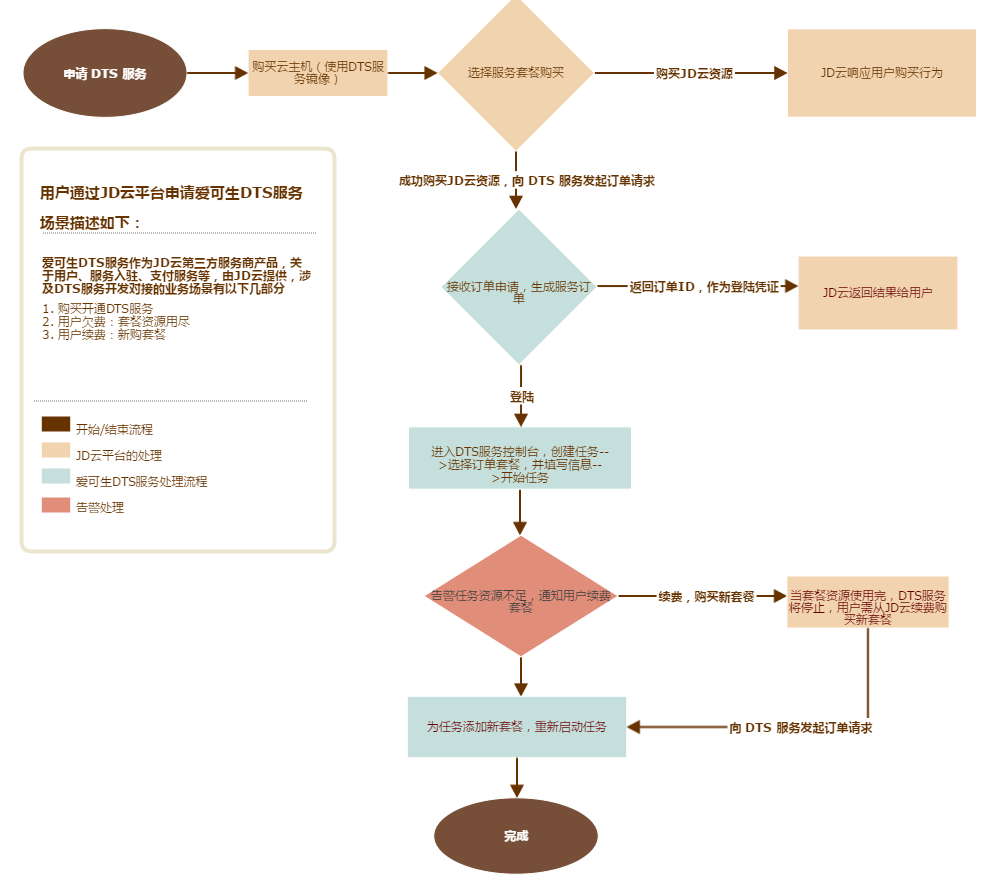

## 购买流程

1. 登录京东云管理控制台，进入云数据库传输服务购买界面。
2. 创建云主机：
* 根据 JD 云平台提供的创建主机流程，选择爱可生 DTS 服务镜像
*  选择配置属性，购买云主机
2. 开通 DTS 服务：
* 选择所需的服务规格

## 计费流程

DTS 按量计费是一种预付费的计费模式：
1、充值、扣费等用户费用相关流程由JD云平台提供
2、用户购买 DTS 服务套餐，任务产生的流量作为消费凭证，相应扣除套餐内的资源总量

> **注意：**
按量计费资源不再使用时**请及时销毁**，以免继续扣费。
已购买的DTS 服务套餐将无法退费，但剩余套餐资源可以给其他数据传输任务使用。
订单资源耗尽将停止DTS 任务，请及时续费，以免影响业务。
DTS 任务销毁/回收后，数据将会被清除且不可找回。

## 续费流程

* 云平台新购 DTS 服务套餐
* DTS 任务列表页续费
选择任务，单击【续费】操作，选择新套餐

## 对接流程

### 镜像服务

* 制作镜像
* 发布镜像

### DTS 产品服务

* 用户购买 DTS 服务套餐
* JD云确认订单，发请求告知 DTS 服务，DTS 返回订单凭证
* 用户使用订单凭证登陆 DTS 服务控制台
* 创建任务（登陆控制台）：任务管理——>创建任务

## 业务流程图

## 接口描述

### GET /v1/cloud/order
## 1. 接口描述
该接口用于云市场新购或续费 DTS 服务订单，返回订单的详细信息。

## 2. 输入参数

| 参数名称 | 是否必选  | 类型 | 描述 |
|---------|---------|---------|
| token | 是 | String | 安全校验令牌 |
| action | 是 | String | “createInstance” |
| jdPin | 是 | String | 用户在京东云的账号标识，具有唯一性 |
| orderBizId | 是 | String | 云市场业务 ID，订购关系ID |
| orderId | 是 | String | 对应订单的ID |
| serviceCode | 是 | String | 服务对应的编码，可在服务商后台的服务列表中查看到 |
| skuId | 是 | String | 服务的收费项目ID |
| mobile | 否 | String | 用户的手机号 |
| email | 否 | String | 用户的邮箱 |
| template | 否 | String | 模板ID，适用于模板类建站商品 |
| expiredOn | 否 | DateTime | 对应订单的到期时间，格式：yyyy-MM-dd HH:mm:ss |

## 3. 输出参数

| 参数名称 | 是否必选  | 类型 | 描述 |
|---------|---------|---------|
| instanceId | 是 | String | 服务商系统创建的订单的ID，建议用传入的服务ID 该ID云市场需要保存； 返回值为0，表示创建中或创建失败； 返回值不为0，表示创建成功|
| appInfo | 否 | Object | 返回的数据 |
| appInfo.frontEndUrl | 否 | String | 前台地址：客户购买商品后，可以访问的网站地址 |
| appInfo.adminUrl | 否 | String | 管理地址：客户购买商品后，可以访问的管理后台地址 |
| appInfo.username | 否 | String | 管理员帐号：客户购买商品后，访问服务商管理后台的账号：一般为邮箱和手机号 |
| appInfo.password | 否 | String | 管理员密码：客户购买商品后，访问服务商管理后台的密码：一般为服务商生成。 |
| appInfo.authUrl | 否 | String | 免登地址： 服务商提供给客户的免登陆地址。 |
| appInfo.authCode | 否 | String | 软件序列号（license）：客户购买商品后，可用于注册使用的授权码 |
| info | 否 | Object | key-value格式|

> **补充：**请求参数中的服务的收费项目ID（skuId）对应DTS服务套餐，例按使用流量计费，爱可生发布两类服务到云市场：
> DTS 服务 1：1TB
> DTS 服务 2：2TB
此服务规格内容作为限制依据，云平台开通DTS服务传入相应服务ID