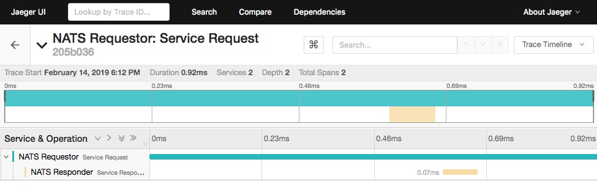
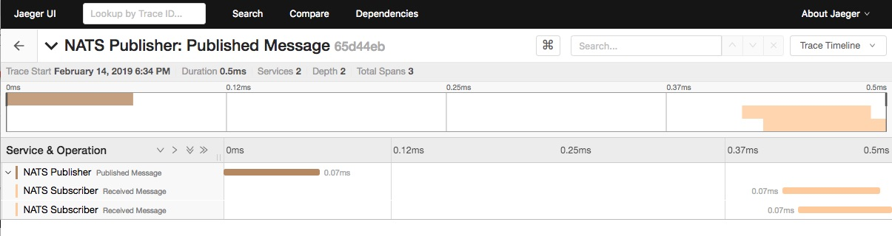

# OpenTracing with NATS

Over the years, we've had periodic requests to support distributed tracing in
[NATS](https://nats.io).  While distributed tracing is valuable,
philosophically we did not want to add external dependencies to NATS,
internally or via API.  Nor did we want to provide guidance that would make
developers work in ways that  didn't feel natural or aligned with the tenets
of NATS.  We left it to the application developers using NATS.

[OpenTracing](https://opentracing.io) changes this and offers a way to
implement distributed tracing with NATS that aligns with our goals and
philosophy of simplicity and ease of use and does not require adding
dependencies into NATS.  This repository provides a reference to
facilitate the use of OpenTracing with NATS enabled applications.

## What is OpenTracing

OpenTracing provides a non-intrusive vendor-neutral API and instrumentation
for distributed tracing, with wide language support.  Because each use case
is slightly different, we've decided not to provide specific implementations
at this point.  Instead we are providing a reference architecture with
examples demonstrating easy usage of OpenTracing with NATS.  In line with
other NATS projects, these canonical examples are provided in
[Go](https://golang.org), but this approach should port smoothly into many
other languages.  More language examples will be added soon.

## How it works

OpenTracing is actually fairly simple to implement in an applicaton.
A "Trace" is defined, and then sets up "spans" to represent an operation
or event and log information, which is reported to the OpenTracing aggregator
for reporting and display.

To propogate, span contexts are serialized into a NATS message using the
binary format. We provide a `not.TraceMsg` which will do what is needed to
[inject](https://opentracing.io/docs/overview/inject-extract/) span contexts
into messages and to extract them on the other side.

Here's how to send a span context over NATS.

```go
// A NATS OpenTracing Message.
var t not.TraceMsg

// Setup a span for the operation to publish a message.
pubSpan := tracer.StartSpan("Published Message", ext.SpanKindProducer)
ext.MessageBusDestination.Set(pubSpan, subj)
defer pubSpan.Finish()

// Inject span context into our traceMsg.
if err := tracer.Inject(pubSpan.Context(), opentracing.Binary, &t); err != nil {
    log.Fatalf("%v for Inject.", err)
}

// Add the payload.
t.Write(msg)

// Send the message over NATS.
nc.Publish(subj, t.Bytes())
```

Note that the payload is added after injection.  This order is a requirement, but
simplifies the API and feels natural.

Retrieving a span from an inbound message and associating with a new response
span is straightforward as well.

```go
// Create new TraceMsg from the NATS message.
t := not.NewTraceMsg(msg)

// Extract the span context from the request message.
sc, err := tracer.Extract(opentracing.Binary, t)
if err != nil {
    log.Printf("Extract error: %v", err)
}

// Setup a span referring to the span context of the incoming NATS message.
replySpan := tracer.StartSpan("Service Responder", ext.SpanKindRPCServer, ext.RPCServerOption(sc))
ext.MessageBusDestination.Set(replySpan, msg.Subject)
defer replySpan.Finish()

nc.Publish(msg.Reply, reply)
replySpan.LogEvent(fmt.Sprintf("Response msg: %s", reply))

```

Check out the [examples](./examples) for additional usage.

## Setting up an OpenTracing Tracer

To run the the examples, we setup [Jaeger](https://www.jaegertracing.io/)
as the OpenTracing tracer with its convenient "all-in-one" docker image.
Jaeger is a CNCF open source, end-to-end distributed tracing project.

```bash
docker run -d --name jaeger \
  -e COLLECTOR_ZIPKIN_HTTP_PORT=9411 \
  -p 5775:5775/udp \
  -p 6831:6831/udp \
  -p 6832:6832/udp \
  -p 5778:5778 \
  -p 16686:16686 \
  -p 14268:14268 \
  -p 9411:9411 \
  jaegertracing/all-in-one:1.9
```

See Jaeger's [getting started](https://www.jaegertracing.io/docs/1.9/getting-started/)
documentation for more information.

## Request/Reply Examples

* [Requestor Example](./examples/request/main.go)
* [Replier Example](./examples/reply/main.go)

Open two terminals, in one terminal go to the reply example directory
and run:

```bash
./reply foo "here's some help"
```

In the other terminal, go to the request example direcory and run:

```bash
./request foo help
```

### Request Output

```text
Initializing logging reporter
Published [foo] : 'help'
Received  [_INBOX.4fkjE3Kld4s26FoJxnfxNy.dyOD78y3] : 'here's some help'
Reporting span 3007527f6bf0a38e:3007527f6bf0a38e:0:1
```

### Reply Output

```text
Initializing logging reporter
Listening on [foo]
Received request: help
Reporting span 3007527f6bf0a38e:66628b457927103d:3007527f6bf0a38e:1
```

### Viewing the Request/Reply output in the Jaeger UI

Navigate with a browser to http://localhost:16686.  Find the _NATS Requestor_
service in the services list and click the _Find Traces_ button.  Click on
the _NATS Requestor_ service and you will see a screen similar to the following:



You can see the entire span of the request and the associated replier span.

## Publish/Subscribe Examples

* [Publisher Example](./examples/publish/main.go)
* [Subscriber Example](./examples/subscribe/main.go)

Open three terminals, in the first two terminals go to the subscribe example
directory and run:

```bash
go build
./subscribe foo
```

and in the second terminal:

```bash
./subscribe foo
```

And finally in the third terminal go to the publish example directory:

```bash
go build
./publish foo hello
```

Navigate with a browser to http://localhost:16686.  Find the _NATS Publisher_
service in the services list and click the _Find Traces_ button.  Click on the
_NATS Publisher_ service and you will see a screen to the following:



You can see the publish span and the two associated subscriber spans.  The gap
the middle includes the NATS client library publishing the message, the NATS server
routing and fanning out the message, and the subscriber NATS clients receiving the
messages and passing them to application code where the subscriber span is reported.

### Subscriber Output

```text
Initializing logging reporter
Listening on [foo]
Received msg: "hello"
Reporting span 2b78c114fc32bcad:132b0c35588f3c16:2b78c114fc32bcad:1
```

### Publisher Output

```text
Initializing logging reporter
Published [foo] : 'hello'
Reporting span 2b78c114fc32bcad:2b78c114fc32bcad:0:1
```

## Our sponsor for this project

Many thanks to [MasterCard](http://mastercard.com) for sponsoring this project.
We appreciate MasterCard's support of NATS, CNCF, and the OSS community.